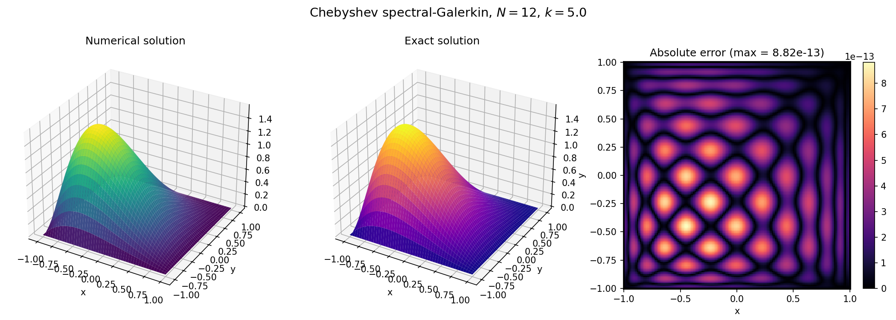
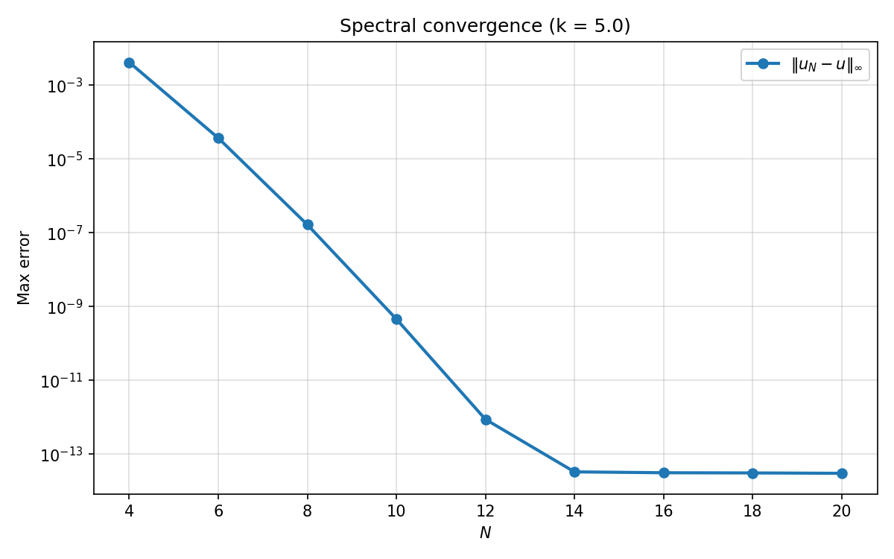
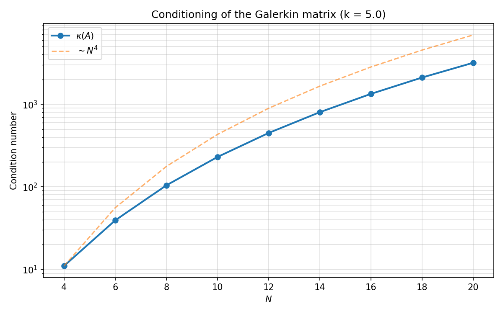
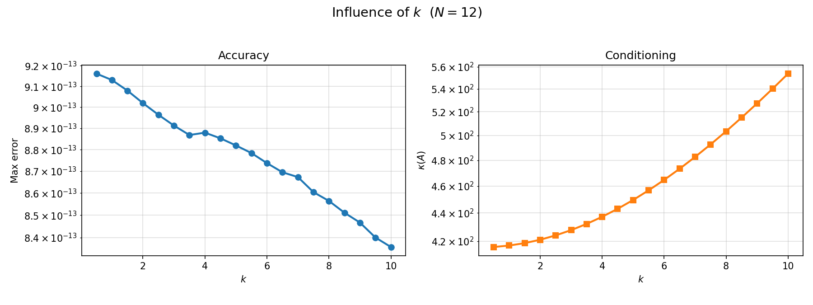

# Chebyshev Spectral–Galerkin Method for the Helmholtz Equation

Theoretical derivation and numerical implementation of a
Chebyshev spectral–Galerkin method for the 2D Helmholtz equation
with homogeneous Dirichlet boundary conditions, validated against
a manufactured solution and recovering **spectral convergence down
to machine precision** (~3 × 10⁻¹⁴).

This repository is the companion code and written report for a
project in the course *Numerical Analysis of PDEs and Approximation*
of the M.Sc. in Physics and Mathematics (Fisymat) at the University
of Granada.

---

## Problem

Solve on $\Omega = (-1,1)\times(-1,1)$ with homogeneous Dirichlet
boundary conditions,

$$
-\Delta u + k^{2} u = f,
\qquad
u|_{\partial\Omega} = 0.
$$

As a validation problem we use the method of manufactured solutions
with

$$
u_{\text{exact}}(x,y) = (1-x^{2})(1-y^{2})\, e^{-x-y},
$$

so that

$$
f(x,y) = e^{-x-y}\bigl[(1-y^{2})(x^{2}-4x+1) + (1-x^{2})(y^{2}-4y+1)
+ k^{2}(1-x^{2})(1-y^{2})\bigr].
$$

---

## Method

The key ideas of the spectral–Galerkin discretisation are summarised
below; full derivations are provided in the PDF reports.

| Step | What we do |
|------|------------|
| 1 | Multiply by a test function $v \in H^1_0(\Omega)$, integrate and use Green's identity to obtain the weak form $a(u,v) = L(v)$. |
| 2 | Build the boundary-adapted Chebyshev basis $\phi_n(x) = T_{n+2}(x) - T_n(x)$ (so $\phi_n(\pm 1) = 0$). |
| 3 | Take the tensor-product space $V_N = \text{span}\{\phi_i(x)\phi_j(y)\}$ as trial/test space. |
| 4 | Assemble 1D mass $M$ and stiffness $K$ with Gauss–Legendre quadrature. |
| 5 | Exploit the tensor structure: $A = K\otimes M + M\otimes K + k^{2}\,M\otimes M$. |
| 6 | Solve the linear system $A\mathbf u = \mathbf b$ for the flattened coefficients $u_{ij}$. |

The whole method lives in the `chebyshev` package
([`chebyshev/core.py`](chebyshev/core.py)), and every numerical
experiment below is a ~40-line standalone script that imports from it.

---

## Results

### Solution vs. exact for $N = 12$, $k = 5$

Twelve basis functions per direction already give errors below
$10^{-12}$ in the max norm.



### Spectral convergence

For the $C^\infty$ manufactured solution the max-norm error drops
from $\sim 4\times 10^{-3}$ at $N=4$ to the $\sim 3\times 10^{-14}$
floor at $N \ge 14$ — a rate faster than any polynomial in $N$.



### Condition number

$\kappa(A)$ grows polynomially, following the expected
$\mathcal{O}(N^4)$ rate for Chebyshev Galerkin discretisations of the
2D Laplacian.



### Influence of the wavenumber $k$

For this smooth non-oscillatory manufactured solution the reaction
term $k^2 u$ reinforces the coercivity of the bilinear form, and
both the error and the condition number slowly **decrease** as $k$
grows.



---

## Reports

| Language | File |
|----------|------|
| English  | [`MemoryEN.pdf`](MemoryEN.pdf) |
| Español  | [`MemoriaES.pdf`](MemoriaES.pdf) |

LaTeX sources in [`latex/`](latex).

---

## Repository structure

```
Chebyshev-Spectral-Galerkin-Method-for-the-Helmholtz-Equation-Theory-and-Implementation/
├── chebyshev/
│   ├── __init__.py           # package exports
│   └── core.py               # basis, quadrature, matrix assembly, solver
├── scripts/
│   ├── run_solution.py       # solve + 3D plot + pointwise error map
│   ├── run_convergence.py    # spectral convergence study
│   ├── run_condition.py      # conditioning of A vs N
│   └── run_k_influence.py    # error and cond vs k
├── figures/                  # PNGs produced by the scripts above
├── latex/
│   ├── main_EN.tex
│   ├── main_ES.tex
│   ├── bibliography.bib
│   └── escudoUGRmonocromo.png
├── Helmholtz.ipynb           # original notebook (kept for reference)
├── MemoryEN.pdf
└── MemoriaES.pdf
```

---

## Usage

Requires Python 3.10+, `numpy`, `scipy` and `matplotlib`.

```bash
python scripts/run_solution.py       # 3D numerical vs exact + error map
python scripts/run_convergence.py    # spectral convergence
python scripts/run_condition.py      # conditioning vs N
python scripts/run_k_influence.py    # error and cond vs k
```

Each script writes its figure to `figures/`.

---

## Author

**A. S. Amari Rabah** — M.Sc. in Physics and Mathematics (Fisymat),
University of Granada.
